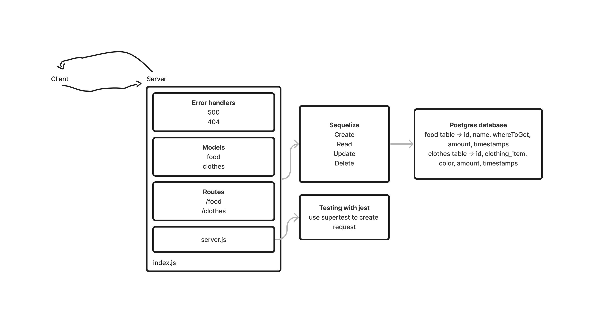

# LAB - Class 3 & 4

## Project: API Server

### Author: Jelani Rhinehart

### Problem Domain  

Build a REST API using Express, by creating a proper series of endpoints that perform CRUD operations on a Postgres SQL Database, using the REST standard.

### Links and Resources

- [GitHub Actions ci/cd](https://github.com/Jchips/api-server/actions)
- [back-end server url](https://api-server-dev-u3w5.onrender.com)
- [Pull Request](https://github.com/Jchips/api-server/pull/3)

### Setup

#### `.env` requirements

- PORT:enter-whatever-port-you-want
- DATABASE_URL=postgres-database-url

#### How to initialize/run your application

- `nodemon` (if installed) OR
- `npm start`

#### Features / Routes

- What was your key takeaway?

    My key takeaway is that making a collection makes it easier to make changes to the CRUD operations if something changes, so that I don't have to edit every individual route file for any minor change.

- Pull request

    <https://github.com/Jchips/api-server/pull/3>

- GET : `/food` - Fetches all the food
- GET : `/food/:id` - Fetches specific food
- POST : `/food` - Add food
- PUT : `/food/:id` - Update specific food
- DELETE : `/food/:id` - Delete specific food

- GET : `/clothes` - Fetches all the clothes
- GET : `/clothes/:id` - Fetches specific clothing item
- POST : `/clothes` - Add clothes
- PUT : `/clothes/:id` - Update specific clothing item
- DELETE : `/clothes/:id` - Delete specific clothing item

#### Tests

- How do you run tests?
`npm test`
- Any tests of note?
  - Tests to make sure CRUD operations are performing right
  - Error handling tests

#### UML

